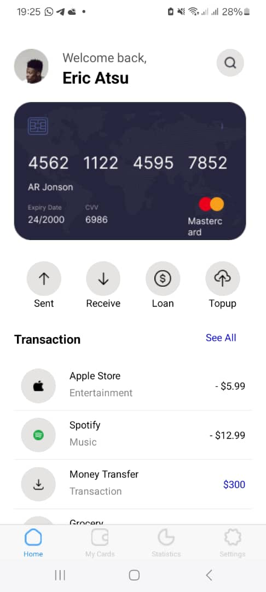
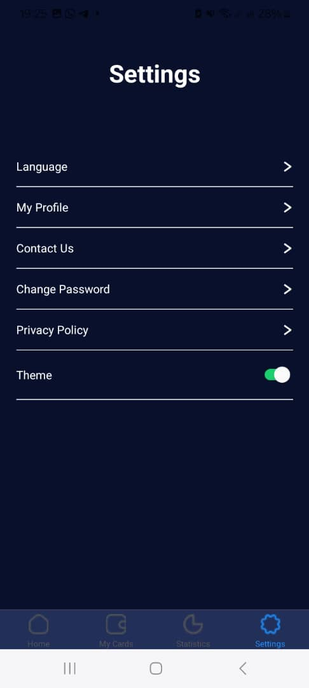

# rn-assignment5-11015722

 # Description
  Thie application was built usin react and expo. It was four pages with only 2 being active.
  These pages inclide ; Home, My Cards, Statistics and settings page. The application has the
   ability to switch between themes , that is, dark theme and light theme. 
   The application has a buttom navigation bar that is used to navigate through the various pages.

# Home page
The home page has an image profile, various images in the form of icons and an image of a credit card.
It shows the various transactions available also.

# Settings page
The settings page contains various functions including a switch for changing themes. The bottom navagation bar gets affected by it. 

 # Technologies Used
React Native: A JavaScript framework for building mobile applications.
Expo: A set of tools and services for building and deploying React Native apps.
React Navigation: Routing and navigation for React Native apps.

StyleSheet: React Native's built-in component for styling.

# Light view

# Dark view

